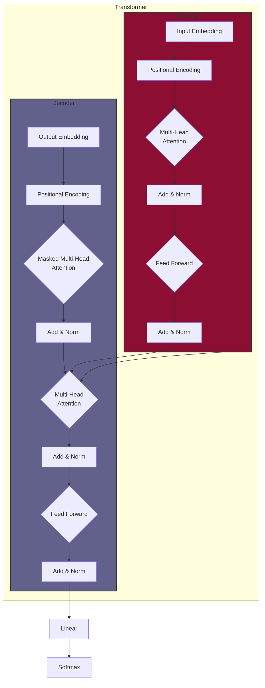

# Attention Is All You Need: A Transformer Implementation

This repository contains a PyTorch implementation of the Transformer model, as described in the paper "Attention Is All You Need" by Vaswani et al. [link to paper](https://arxiv.org/abs/1706.03762)

## Introduction

The Transformer model is a sequence-to-sequence architecture that relies entirely on self-attention mechanisms, dispensing with recurrence and convolutions. This design allows for significantly more parallelization and has become a foundational model for many state-of-the-art NLP tasks.

## Architecture

The Transformer architecture is composed of an Encoder and a Decoder. The Encoder maps an input sequence of symbol representations to a sequence of continuous representations. The Decoder then generates an output sequence one symbol at a time, using the encoder's output and its own previously generated outputs.

Here is a visualization of the architecture:



## File Structure

The project is organized as follows:

```
/
├── src/
│   ├── model/
│   │   ├── __init__.py
│   │   ├── attention.py       # Scaled Dot-Product & Multi-Head Attention
│   │   ├── layers.py          # Positional Encoding, Feed-Forward Network
│   │   ├── encoder.py         # Encoder Layer & Encoder Stack
│   │   ├── decoder.py         # Decoder Layer & Decoder Stack
│   │   └── transformer.py     # The complete Transformer model
│   ├── config.py            # Hyperparameters and configuration
│   ├── data.py              # Data loading and preprocessing
│   └── train.py             # Training and optimization loop
├── tests/                   # Unit tests for model components
├── notebooks/               # Jupyter notebooks for experimentation
├── requirements.txt         # Project dependencies
└── README.md                # Project description
```

## Getting Started

### Prerequisites

- Python 3.9+
- PyTorch
- Spacy

### Installation

1.  Clone the repository:
    ```bash
    git clone https://github.com/arJ-V/Attention-is-all-you-need.git
    cd Attention-is-all-you-need
    ```

2.  Install the required dependencies:
    ```bash
    pip install -r requirements.txt
    ```

3.  Download the necessary Spacy models:
    ```bash
    python -m spacy download en_core_web_sm
    python -m spacy download de_core_news_sm
    ```

### Running the Code

To start the training process (with placeholder data), run:

```bash
python -m src.train
```

This will instantiate the model and begin the training loop. The current implementation uses a small, placeholder dataset. To use a real dataset, you will need to modify `src/data.py`.

## Contributing

Contributions are welcome! Please feel free to submit a pull request or open an issue.
